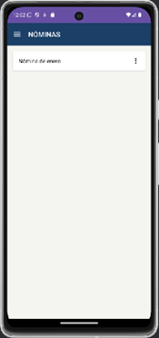
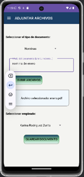

# 📲 NeoFichaje

**NeoFichaje** es una aplicación Android diseñada para optimizar el control horario y la gestión de empleados en pequeñas y medianas empresas. Esta solución móvil permite a los trabajadores registrar sus jornadas laborales, solicitar vacaciones y consultar documentos, mientras que los empresarios pueden gestionar su equipo de manera eficiente desde cualquier lugar.

---

## 🚀 Tecnologías utilizadas

- **Android Studio** – Entorno de desarrollo
- **Kotlin** – Lenguaje de programación principal
- **XML** – Diseño de interfaces de usuario
- **Firebase Authentication** – Registro e inicio de sesión seguros
- **Firestore** – Base de datos NoSQL en la nube
- **Firebase Cloud Storage** – Almacenamiento de documentos (contratos, nóminas)
- **Google Sign-In** – Autenticación con cuenta de Google
- **MaterialCalendarView** – Selección de fechas con componente de calendario

---

## 👥 Roles de usuario

### 👤 Empleado / Técnico:
- Fichaje de entradas y salidas
- Solicitudes de vacaciones y permisos
- Visualización de documentos personales

### 🧑‍💼 Administrador / Empresario:
- Alta y gestión de empleados
- Aprobación de solicitudes
- Subida de documentos (contratos, nóminas)
- Control de asistencia

---
## 🧩 Funcionalidades destacadas

- 📅 Fichaje con geolocalización
- 🔐 Registro y login con correo y Google
- 📄 Consulta y descarga de contratos y nóminas
- 🌴 Gestión de vacaciones y permisos
- 🔔 Sistema de notificaciones internas
- 🧾 Historial de actividad por usuario

---

## 🔄 Flujo de uso

1. El usuario se registra o inicia sesión.
2. Según su rol, accede al panel correspondiente.
3. Los empleados fichan su jornada o gestionan sus solicitudes.
4. Los empresarios supervisan, aprueban y cargan documentos.

---

## 📂 Estructura del proyecto
- /app → Código fuente principal (Activities, Fragments, ViewModels)
- /images → Capturas de pantalla para documentación
- /gradle → Configuraciones del sistema de build
- firebase.json → Configuración de servicios en la nube (Firebase)
- README.md → Documentación del proyecto

---

## 📸 Capturas de pantalla

### 🔐 Pantalla de inicio de sesión

### 📝 Registro de nuevo usuario

### 👤 Menú del empleado

### 🧑‍💼 Menú del empresario

### 🕒 Control de asistencia

### 👥 Gestión de empleados

### 🌴 Solicitud de vacaciones

### 📄 Consulta de nóminas

### 📎 Adjuntar documentos

### 🏁 Pantalla de inicio del empleado

### ⏱ Control horario

---

## 📈 Seguimiento del proyecto

Puedes consultar el progreso completo en el historial de [commits](https://github.com/KarinaRojasDev/proyecto-neo-fichaje/commits/main), donde se documenta cada fase del desarrollo, desde el diseño inicial hasta la implementación final.

---

## 👩‍💻 Autora

Desarrollado por **Karina Rojas**, como proyecto final del segundo curso del ciclo de **Desarrollo de Aplicaciones Multiplataforma (DAM)**.

> Este proyecto refleja el esfuerzo, dedicación y pasión por el desarrollo móvil, con el objetivo de aportar valor real al mundo empresarial actual.
